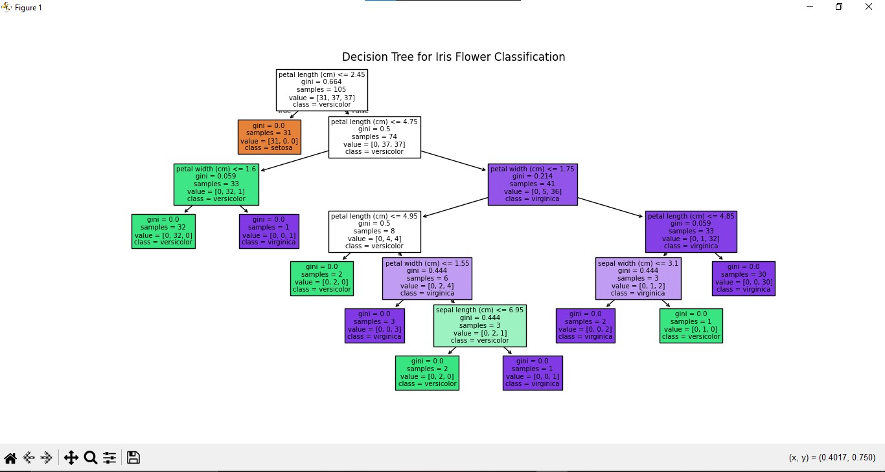

# 🌸 Iris Flower Classification using Decision Tree

This project demonstrates a **Decision Tree Classifier** built with Scikit-learn to classify iris flowers into three species using the famous Iris dataset
The model is trained, evaluated, and visualized using Python libraries including Pandas, Scikit-learn, and Matplotlib.

---

## 📌 Dataset

The dataset used in this project is the built-in **Iris dataset** provided by Scikit-learn.

* **Features:**

  * Sepal Length
  * Sepal Width
  * Petal Length
  * Petal Width
* **Target Classes:**

  * Setosa (0)
  * Versicolor (1)
  * Virginica (2)

---

## ⚙️ Technologies Used

* Python
* Pandas
* Scikit-learn
* Matplotlib

---

## 🧠 Model Used

* Decision Tree Classifier
* Train/Test Split: 70% Training / 30% Testing
* Evaluation Metrics:

  * Accuracy Score
  * Confusion Matrix
  * Classification Report

---

## 🚀 How to Run the Project

### 1️⃣ Install Required Libraries

```bash
pip install pandas scikit-learn matplotlib
```

### 2️⃣ Run the Script

```bash
python main.py
```

The program will:

* Load the Iris dataset
* Train a Decision Tree model
* Evaluate performance
* Display the decision tree visualization

---

## 📊 Model Performance

The script prints:

* Accuracy percentage
* Confusion Matrix
* Classification Report (Precision, Recall, F1-score)

---

## 🌳 Decision Tree Visualization

Below is the visualization of the trained Decision Tree:




---


## 📖 Learning Objectives

This project helps you understand:

* How classification works
* How Decision Trees split data
* How to evaluate machine learning models
* How to visualize a trained model

---

## ✅ Output Example

Example console output:

```
Accuracy: 100.00%

Confusion Matrix:
[[19  0  0]
 [ 0 13  0]
 [ 0  0 13]]

Classification Report:
              precision    recall  f1-score   support
...
```

---

⭐ If you found this project helpful, consider giving it a star!
